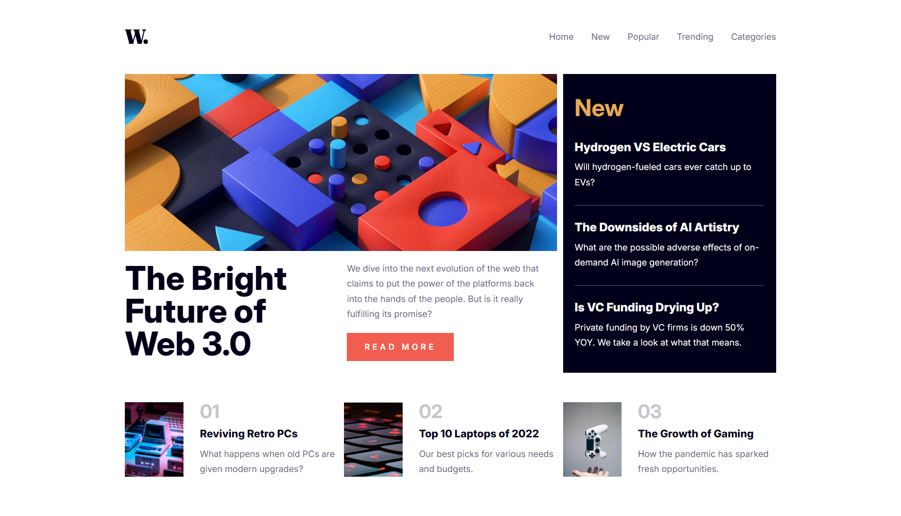

<h1 align="center"> ✨ The Final CSS Project ✨ </h1>

### 🌐 Demo / Preview


---

### ✏️ **Description**
This was the final project dedicated to mastering CSS basics. It is a pixel-perfect recreation of a Figma design with full responsiveness. It represents the first time I combined all my basic CSS skills into a single cohesive design. This project was created after just a few weeks of coding experience.

### 💻 **Technologies Used**
- **HTML5**: For structuring the content of the page.
- **CSS3**: For styling, visual appearance, and responsiveness.

### **Key Features** 🚀
🎯 Pixel-perfect design: Faithful reproduction of the Figma mockup.  

📱 Fully responsive: Adapted for various screen sizes.  

🛠️ Comprehensive CSS usage: Showcases mastery of foundational CSS concepts, including flexbox, grid, and responsive design techniques.

### 🛠️ **Installation & Usage**
1. Clone the repository:  
   ```bash
   git clone https://github.com/HUYBERIC/TheFinalProjectCss.git  
   cd TheFinalProjectCss  
   ```  

2. Open `index.html` in your favorite browser to view the project.

<br> 
<br> 
<br> 

---

<h1 align="center"> ✨ Le dernier projet CSS ✨ </h1>

---

### ✏️ **Description**
Ce projet représente l'aboutissement de ma maîtrise des bases du CSS. Il s'agit d'une reproduction pixel-perfect d'un design Figma, avec une mise en page entièrement responsive. C'est le premier projet où j'ai combiné toutes mes compétences CSS de base au service d'un seul et même design. Ce projet a été réalisé après seulement quelques semaines d'expérience en programmation.

### 💻 **Technologies utilisées**
- **HTML5** : Pour structurer le contenu de la page.
- **CSS3** : Pour le style, l'apparence visuelle et la responsivité.

### **Caractéristiques principales** 🚀
🎯 Design pixel-perfect : Reproduction fidèle de la maquette Figma.  

📱 Entièrement responsive : Adapté à différentes tailles d'écran.  

🛠️ Utilisation complète du CSS : Montre la maîtrise des concepts fondamentaux du CSS, y compris flexbox, grid et les techniques de design responsive.

### 🛠️ **Installation & Utilisation**
1. Cloner le dépôt:
   ```bash
   git clone https://github.com/HUYBERIC/TheFinalProjectCss.git
   cd TheFinalProjectCss 
   ```
2. Ouvre `index.html` dans ton navigateur favori pour voir le projet.


